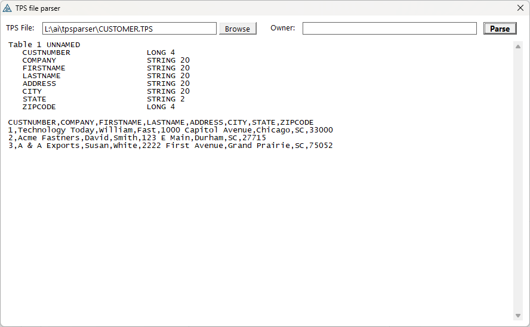

# TpsParserType

`TpsParserType` is a reusable Clarion class for reading records, fields, memos, and blobs from TPS files, including damaged files where recoverable pages can still be parsed.



## Attribution and license

This parser is a Clarion port/adaptation of logic from the original Java project `ctrl-alt-dev/tps-parse`.

Original project attribution:

- Project: `ctrl-alt-dev/tps-parse`
- URL: https://github.com/ctrl-alt-dev/tps-parse
- Author / copyright: (C) 2012-2021 E. Hooijmeijer / Erik Hooijmeijer
- Organization / site: ctrl-alt-dev, http://www.ctrl-alt-dev.nl/
- License: Apache License 2.0, https://www.apache.org/licenses/LICENSE-2.0.html
- Local license copy: `Apache-2.0.txt`

The original project describes itself as reverse-engineered TPS parsing software. Its warning applies here as well: TPS parsing may be incomplete and may misinterpret data; verify output before relying on it.

## Files

Include these files in your Clarion project:

- `TpsParser.inc` - class declaration and queue types
- `TpsParser.clw` - class implementation

Include the class in your source:

```clarion
  INCLUDE('TpsParser.inc'),ONCE
```

## Basic usage

```clarion
Parser  TpsParserType
Result  LONG

Result = Parser.Init('C:\data\MyFile.tps')
IF Result <> 0
  MESSAGE('Could not open/parse TPS. Error=' & Parser.GetError())
  RETURN
END

Parser.Set()                  ! start before first record
LOOP UNTIL Parser.Next()      ! Next returns FALSE when a record is available
  ! Read fields here
END

Parser.Kill()
```

## Encrypted files

For encrypted TPS files, pass the owner/password to the overloaded `Init` method:

```clarion
Result = Parser.Init('C:\data\Encrypted.tps','owner-password')
```

The owner string is used as Clarion string bytes directly; no code-page conversion is applied.

## Reading field values

Use `GetField` for a string representation of the field value:

```clarion
NameText = Parser.GetField('Name')
NameText = Parser.GetFieldByNumber(1)
DateText = Parser.GetField('InvoiceDate')   ! formatted with @D10-B
TimeText = Parser.GetField('InvoiceTime')   ! formatted with @T04B
AmountText = Parser.GetField('Amount')      ! numeric auto-converted by Clarion
```

Use typed getters when assigning to typed Clarion fields:

```clarion
Rec:Name        = Parser.GetStringField('Name')
Rec:Active      = Parser.GetByteField('Active')
Rec:Quantity    = Parser.GetLongField('Quantity')
Rec:InvoiceDate = Parser.GetDateField('InvoiceDate')
Rec:InvoiceTime = Parser.GetTimeField('InvoiceTime')
```

For raw bytes:

```clarion
RawValue = Parser.GetRawField('SomeField')
```

## Reading blobs

Blob fields are copied into a Clarion `BLOB` field:

```clarion
Result = Parser.GetBlobField('DocumentBlob',TargetFileBlob)
```

If you do not need the result code, the method can be called as a procedure:

```clarion
Parser.GetBlobField('DocumentBlob',TargetFileBlob)
```

## Arrays / DIM fields

`GetFieldDimension('FieldName')` returns the total number of array elements. TPS metadata stores arrays flattened, so `DIM(3,5)` is exposed as `15` elements.

Array field getters use a 1-based flattened index:

```clarion
Elements = Parser.GetFieldDimension('Scores')
Score1 = Parser.GetLongField('Scores',1)
Score2 = Parser.GetLongField('Scores',2)
```

Scalar fields ignore the dimension parameter.

## Multiple tables / superfiles

```clarion
TableCount = Parser.Tables()
LOOP T# = 1 TO TableCount
  TableName = Parser.GetTableName(T#)
  IF Parser.SetTable(T#) = 0
    ! read records for this table
  END
END
```

## Useful metadata methods

```clarion
RecordCount = Parser.Records()
FieldCount  = Parser.Fields()
FieldName   = Parser.GetFieldNameByNumber(1)
FieldType   = Parser.GetFieldType('Name')
FieldTypeNo = Parser.GetFieldTypeByNumber(1)
FieldSize   = Parser.GetFieldSize('Name')       ! string length, numeric bytes, BCD digits
Decimals    = Parser.GetFieldDecimals('Amount') ! BCD decimals, otherwise 0
FieldNo     = Parser.GetFieldNumber('Name')
ErrorCode   = Parser.GetErrorCode()
ErrorText   = Parser.GetError()
```

`GetFieldType` / `GetFieldTypeByNumber` return Clarion-style type names. Current possible values are:

```text
BYTE
SHORT
USHORT
DATE
TIME
LONG
ULONG
SREAL
REAL
DECIMAL
STRING
CSTRING
PSTRING
GROUP
MEMO
BLOB
UNKNOWN
```

## Return values

These methods return parser error codes:

| Method | Return value |
| --- | --- |
| `Init(fileName)` | `0` on success, otherwise `GetErrorCode()` |
| `Init(fileName,owner)` | `0` on success, otherwise `GetErrorCode()` |
| `SetTable(tableIndex)` | `0` on success, otherwise `GetErrorCode()` |
| `Get(recordNo)` | `0` on success, otherwise `GetErrorCode()` |
| `Set(recordNo = 0)` | `0` on success, otherwise `GetErrorCode()` |
| `GetBlobField(...)` | `0` on success, otherwise `GetErrorCode()` |
| `GetBlobFieldByNumber(...)` | `0` on success, otherwise `GetErrorCode()` |

`Next()` intentionally keeps Clarion iterator/EOF semantics instead of error-code semantics:

| Method | Return value |
| --- | --- |
| `Next()` | `FALSE` when a record is available, `TRUE` at EOF |

Typical loop:

```clarion
Result = Parser.Set()
IF Result <> 0
  MESSAGE(Parser.GetError())
  RETURN
END

LOOP UNTIL Parser.Next()
  ! record is available
END
```

## Error codes

`GetErrorCode()` returns one of these parser error codes. Matching `TpsErr...` equates are declared in `TpsParser.inc`. `GetError()` returns the matching single-line message, with runtime context such as file name, offset, table, field, memo, value, byte count, or Clarion `ERRORCODE()` when available.

### Source file errors

| Code | Message |
| ---: | --- |
| 1001 | Could not open source file |
| 1002 | Source file is empty |
| 1003 | Could not read source file |

### TPS header errors

| Code | Message |
| ---: | --- |
| 1101 | Source is too short to be a TPS file |
| 1102 | Invalid TPS header marker |
| 1103 | Invalid TPS header size |
| 1104 | Invalid TPS signature |

### Encrypted TPS errors

| Code | Message |
| ---: | --- |
| 1201 | Encrypted TPS is too short to decrypt header |
| 1202 | Encrypted TPS decrypt failed at header |
| 1203 | Encrypted TPS decrypt failed; bad owner/password or invalid header marker |
| 1204 | Encrypted TPS decrypt failed; bad owner/password or invalid signature |
| 1205 | Encrypted TPS decrypt failed for a data range |
| 1206 | Decrypt range is outside source |
| 1207 | Decrypt range is not 64-byte aligned |

### Table selection errors

| Code | Message |
| ---: | --- |
| 1301 | Invalid table index |

### Table layout / metadata errors

| Code | Message |
| ---: | --- |
| 1401 | No table definitions found |
| 1402 | Incomplete table definition |
| 1403 | Incomplete field definition header |
| 1404 | Incomplete field definition body |
| 1405 | Incomplete BCD metadata |
| 1406 | Incomplete string metadata |
| 1407 | Incomplete string external-name marker |
| 1408 | Incomplete memo external-name marker |
| 1409 | Incomplete memo definition |
| 1410 | No fields found in table definition |

### Record navigation errors

| Code | Message |
| ---: | --- |
| 1501 | Invalid record index |
| 1502 | Record index not found |

### MEMO/BLOB read errors

| Code | Message |
| ---: | --- |
| 1601 | Invalid blob read context |
| 1602 | Field is not MEMO/BLOB |

## Notes

- `Init`, `SetTable`, `Get`, `Set`, and blob getters return `0` on success or a parser error code on failure.
- `GetErrorCode()` returns the numeric error code. `GetError()` returns a single-line diagnostic string with extra context when available.
- `Next` returns `FALSE` when a record is available and `TRUE` at EOF; it does not return an error code.
- Call `Kill` when finished to release parser buffers and queues.
- For damaged TPS files, the parser attempts to recover readable data and partial blob content where possible.
